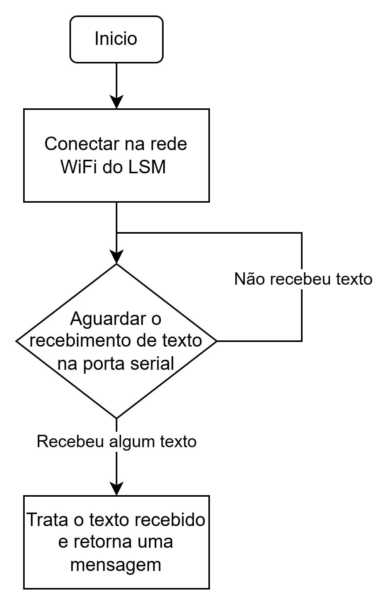

# ESP-01 ThingsBoard Bridge

Autor: [Kaique Dognani](https://github.com/kaiqued1)

> Este repositório tem o intuito de te ajudar a conectar seu projeto físico ao Thingsboard utilizando apenas uma ESP-01

## Materiais necessários:
- ESP-01 com o código deste repositório já em seu Firmware
- Dispositivo Serial para comunicar com a ESP-01

## Entendendo o código da ESP-01:

O código que está rodando na ESP-01 funciona com base no seguinte fluxograma básico:

