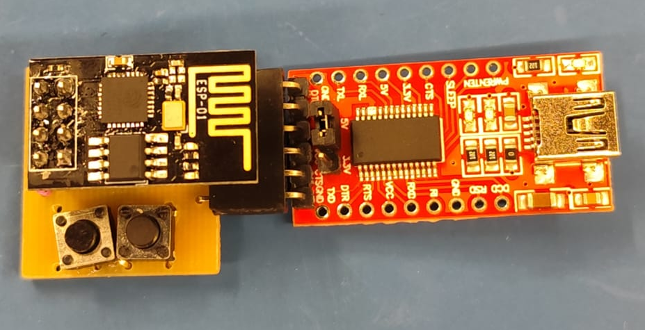
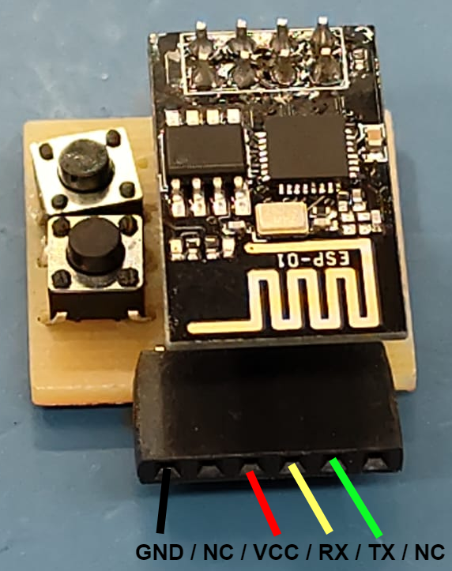
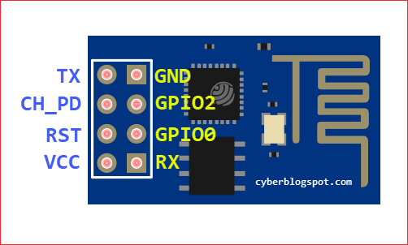

# ESP-01 ThingsBoard Bridge

Autor: [Kaique Dognani](https://github.com/kaiqued1)

> [!NOTE]
> Este repositório tem o intuito de te ajudar a conectar seu projeto físico ao Thingsboard utilizando apenas uma ESP-01, ao final deste manual você será capaz de enviar dados por uma porta serial para a ESP-01 e vizualizá-los em seu ThingsBoard

> [!TIP]
> O projeto foi realizado em PlatformIO, caso queira modificar a rede de WiFi ou qualquer detalhe contido neste basta clonar este repositório e abrir no VScode tendo a extensão do PlatformIO instalada e subir o novo código em sua ESP-01.

## Materiais necessários:
- ESP-01 com o código deste repositório já em seu Firmware
- Dispositivo Serial para comunicar com a ESP-01

## Entendendo o código da ESP-01:

O código que está rodando na ESP-01 funciona com base no seguinte fluxograma básico:

Em outras palavras:

1. A ESP-01 tenta se conecta com o WiFi do LSM e enquanto não conseguir imprime "." na serial
2. Após se conectar no WiFi ela fica aguardando o envio de comandos
3. Caso recaba alguma mensagem a placa irá tratar o texto e retornar alguma mensagem

## Mensagens possíveis:
- "100" - Erro WiFi não conectado
- "101" - Erro WiFi conectado, mas JSON com erro
- "200" - Conexão com o Thingsboard bem sucedida

Outras mensagens serão Erros de HTTP, como 404, 500, etc.

Um outro erro possível será perceptível caso a ESP-01 fique enviando "." sem parar, isso significa que a placa não conseguiu conectar na rede WiFi configurada.

## Como conectar a ESP-01:
> [!TIP]
> Caso deseje você pode fazer a sua própria PCB, o arquivo Proteus e os Gerbers estão na pasta "Proteus"

### Caso você tenha a PCB + Conversor Serial TTL:

Basta montar o conjunto conforme a imagem a cima, conectar em seu computador o conversor e abrir o seu monitor serial de preferência.
> [!WARNING]
> Para que o conversor funcione corretamente deixe o Jumper conectado ao 5V

### Caso você tenha a PCB:

As conexões estão descritas na imagem a cima, basta conectar o RX da placa no TX de seu projeto, o TX da placa no RX de seu projeto, conectar os GND's e por último alimentar a placa com 3.3V.

### Caso você tenha apenas a ESP-01:

