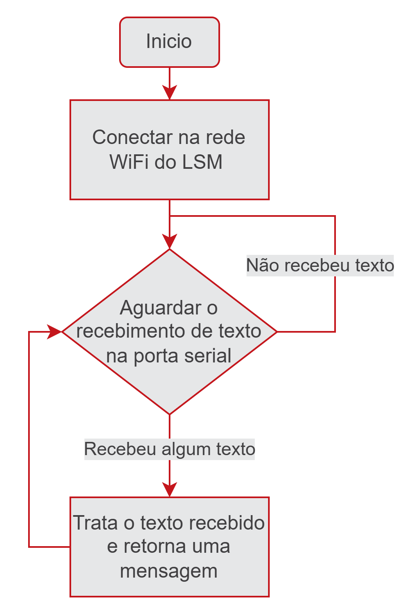

# ESP-01 ThingsBoard Bridge

Autor: [Kaique Dognani](https://github.com/kaiqued1)

> [!NOTE]
> Este repositório tem o intuito de te ajudar a conectar seu projeto físico ao Thingsboard utilizando apenas uma ESP-01, ao final deste manual você será capaz de enviar dados por uma porta serial para a ESP-01 e vizualizá-los em seu ThingsBoard

> [!TIP]
> O projeto foi realizado em PlatformIO, caso queira modificar a rede de WiFi ou qualquer detalhe contido basta clonar este repositório e abrir no VScode tendo a extensão do PlatformIO instalada e subir o novo código em sua ESP-01.

## Materiais necessários:
- ESP-01 com o código deste repositório já em seu Firmware
- Dispositivo Serial para comunicar com a ESP-01

## Entendendo o código da ESP-01:

O código que está rodando na ESP-01 funciona com base no seguinte fluxograma básico:

Em outras palavras:

1. A ESP-01 tenta se conecta com o WiFi do LSM e enquanto não conseguir imprime "." na serial
2. Após se conectar no WiFi ela fica aguardando o envio de comandos